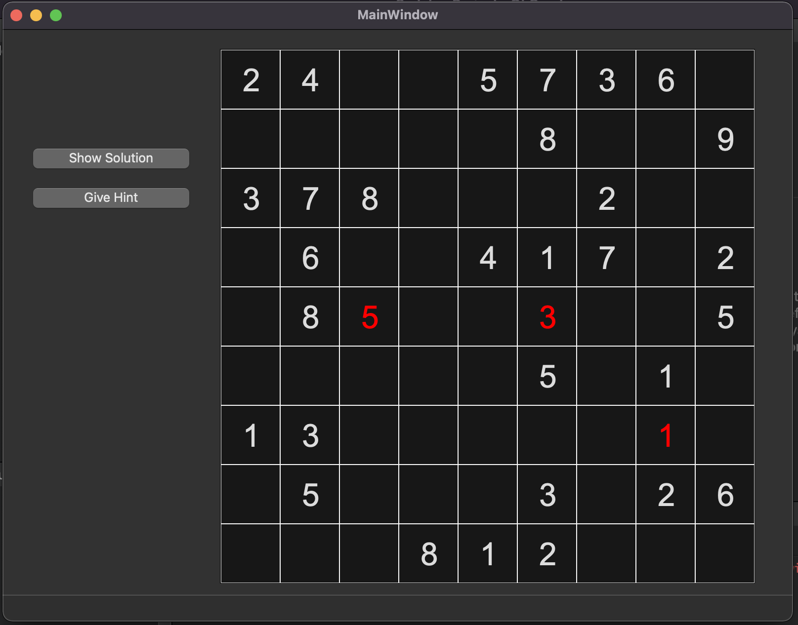
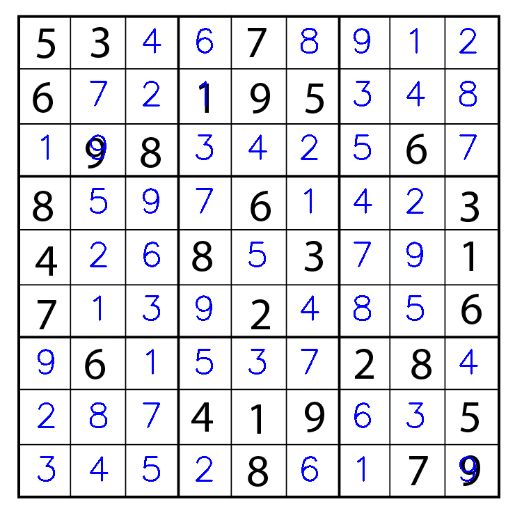

1. Nothing has really changed, as mentioned above I just need to get Tesseract linking to my application through cmake properly but will get that done by Monday. Will still impliment the GUI for the game using Qt as planned.

2. For the most part I accompolished everything I had planned for the final checkpoint though it was not nearly as straight forward as I was expecting. The first issue I set out to solve was implimenting the Tesseract OCR library to read in the images I was processing with OpenCV. I quickly realized the approach I was using to extract these images with OpenCV was not well thought out. I ended up going back and reworking a lot of the computer vision work that read in the initial image and split it into individual cells to perform character recognition on. Once I had this done I figured Tesseract would be pretty straight forward considering it is a praised OCR framework. This was also not the case, I spent a lot of time reading over documentation and watching tutorials on Tesseract, there are a lot of different parts you have to specify depending on what sort of character recognition you hope to do (ie just numbers, single characters etc). Looking back this is pretty obvious but it took a lot of time to figure this out. 
This next part of this project I had to tackle was the Qt GUI implimentation. This was my first time really using Qt becides the basic examples we did in class so it took some time to get comfortable with it. I implimented a sudoku GUI that allows you to select all the options that were possible in the terminal version of my application. I was able to completely link up the computer generated boards to the GUI. I had to modify the majority of methods I had implimented in the terminal to work properly with Qt. However, OpenCV and Qt would not link properly, due to what it seemed like was an issue on for macOS. It is quite dissapointing however I do have the main parts of my project I initially detailed, including the computer vision, working in full.
In my initial proposal I planned to impliment a notes feature inside the GUI,I had one that worked in the terminal but due to time constraints and prioritizing other features, it did not make it to my final GUI. I ended up impliementing a feature that prints the correct digits on the initial sudoku image and returns the image as it was initially passed except the digits are all filled in. 
The biggest challenge I faced for this checkpoint was really working with technology that is completely foreign to me. 
It was quite frusturating having to read through a lot o documentation just to write a few lines of code that still remain in my final project. However, I think this was a good experience for me as I definetly got more comfortable working with technologies that I am uncomfortable with. 

Photo of GUI Interface:

Photo of filled in Sudoku Board:
