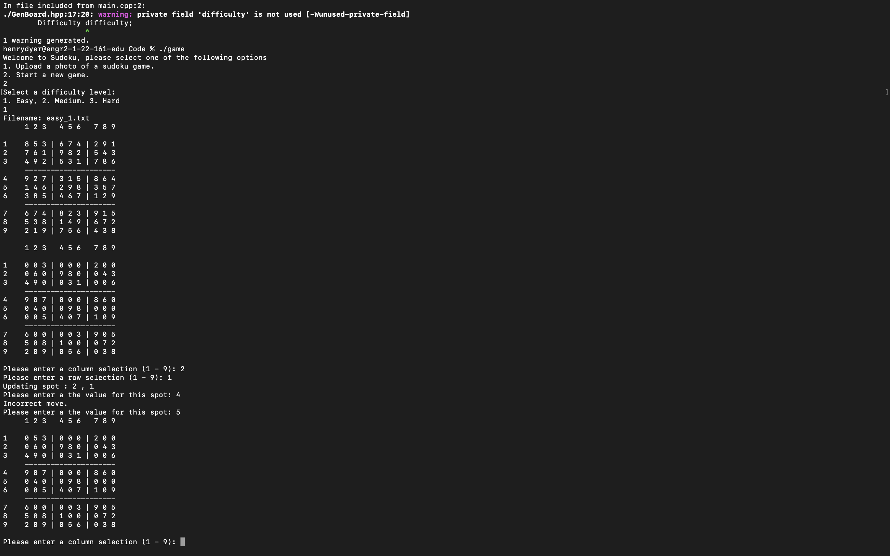

Goal:
Homework 3 Due Date: For the homework three due date I will still be running my sudoku game through the terminal but will have a fully functional game in which the computer can generate a game of varying difficulty and the user can solve the game. All the backend logic for the gameplay will be implemented by this deadline.

What I did:
I now have a fully functioning command line Sudoku game. I also implemented the backtracking algorithm to solve the board
so the computer is aware of when the game is over/if correct moves are made. Initially I hoped to have a way to generate boards
but when we discussed the project we decided this was not the best idea and I just forgot to update that part of my intial proposal. 
Instead I have a folder of text files containing a 9 * 9 grid of numbers. These grids represent differing difficulty levels so when the 
user selects a difficulty level it randomly selects one of the corresponding text files and reads it in as the board for the game.

Whats next:
For the next checkpoint I initially planned on implementing the computer vision aspect of my application and 
I am still planning on doing just that.

Images:

